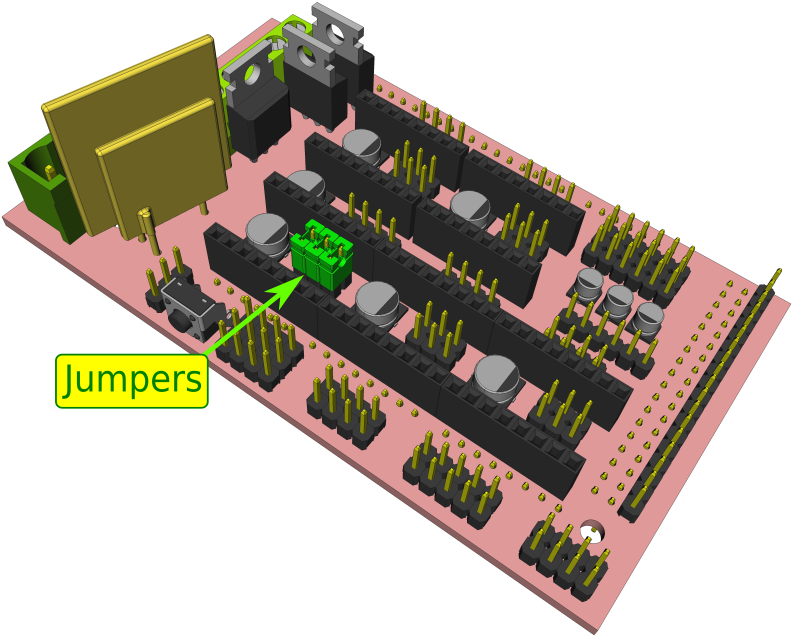
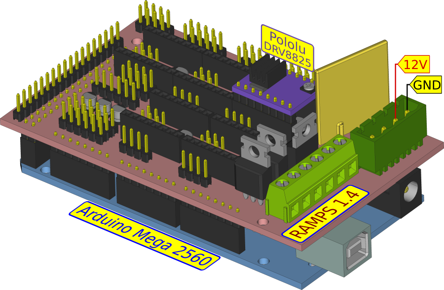
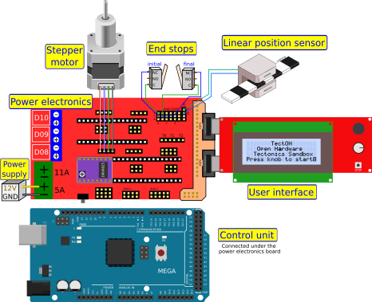

# Electronic Assembly

## 1. Put the jumpers in the motor driver socket of RAMPS 1.4

RAMPS 1.4: [https://reprap.org/wiki/RAMPS_1.4](https://reprap.org/wiki/RAMPS_1.4)

## 2. Attach the RAMPS 1.4 to the Arduino board and attach the motor driver to the RAMPS

Pay attention on the motor driver pinout, do not put it upside-down.
The Pololu DRV8825 and the A4988 have the trimmer in different positions

- Pololu DRV8825: [https://www.pololu.com/product/2133](https://www.pololu.com/product/2133)
- Pololu A4988: [https://www.pololu.com/product/1182](https://www.pololu.com/product/1182)

[Larger image: Arduino-RAMPS-DRV8825](./arduino_ramps_pololu.png)

## 3. Connect the elements as in the figure

If the power suppy is computer ATX, its green cable should be tied to ground (black)

[Larger image of electronics schematic](./electronics_sch_big.png)

The section of the [optional components](../../optional/.) has more information on how to connect the optical sensor.

