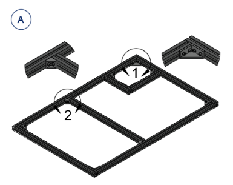
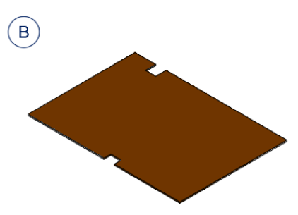
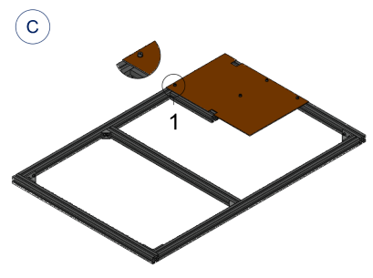
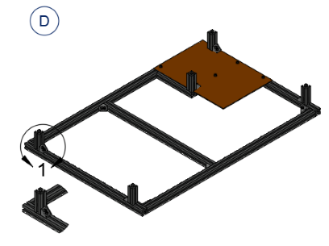
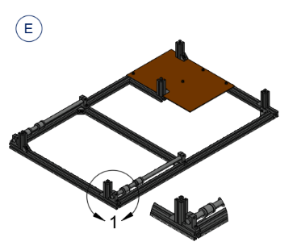
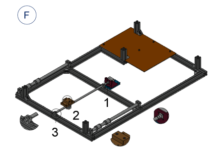
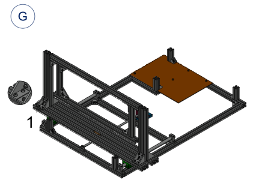
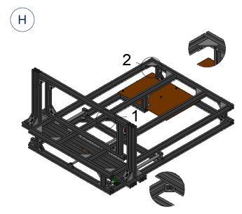
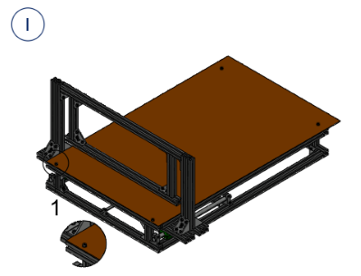

# Sandbox assembly

Besides these instructions assembly section, the CAD source file of the Sandbox can be used as a guide for assembling the Sandbox.

You can open the source file with [FreeCAD](https://www.freecadweb.org/) (free and opensource): [tectoh.FCStd](../cad/freecad/tectoh.FCStd)

We couldn't upload the step file because it was too large for github.

## Step A: Assembly of the structure's lower base

[Larger image](figs/big/step_a.png)

### Parts
| Components | Quantity | 
|-----------------|:--------------:|
| Aluminum profile Type B Slot 8 (30x30x1060 mm) |   2 units  |
| Aluminum profile Type B Slot 8 (30x30x740 mm)  |   2 units   |
| Aluminum profile Type B Slot 8 (30x30x680 mm)  |   1 unit  |
| Aluminum profile Type B Slot 8 (30x30x260 mm)  |   1 unit  |
| Aluminum profile Type B Slot 8 (30x30x220 mm)  |   1 unit  |
| Bracket Type B (30x60 mm)  |   7 units  |
| Bracket Type B (30x30 mm)  |   2 units  |
| M5x14 mm Screw  |   32 units  |
| T-nut for slot 8 type B with spring (M5)   |   32 units  |
| Washer 5 mm  |   32 units  |

### Tools
* Allen Wrench 4

## Step B: Cutout of the lower clamping board 

### Parts
| Components | Quantity | 
|-----------------|:--------------:|
| Wooden Board (440x310x3 mm) |   1 unit  |

### Tools
* Hacksaw
* Keyhole saw
* Rasp

## Step C: Placement of the lower wooden board

[Larger image](figs/big/step_c.png)

### Parts
| Components | Quantity | 
|-----------------|:--------------:|
| Wooden Board (440x310x3 mm) |   1 unit  |
| M5x16 mm Screw  |   4 units  |
| T-nut for slot 8 type B with spring (M5)   |   4 units  |
| Washer 5 mm  |   4 units  |

### Tools
* Allen Wrench 4
* Drill

## Step D: Aluminum profiles's positioning to give height to the structure

[Larger image](figs/big/step_d.png)

### Parts
| Components | Quantity | 
|-----------------|:--------------:|
| Aluminum profile Type B Slot 8 (30x30x90 mm) |   5 units  |
| Bracket Type B (30x30 mm)  |   5 units  |
| M5x14 mm Screw  |   8 units  |
| M5x16 mm Screw  |   2 units  |
| T-nut for slot 8 type B with spring (M5)   |   10 units  |
| Washer 5 mm  |   10 units  |

### Tools
* Allen Wrench 4

## Step E: Kinematic pairs's assembly

[Larger image](figs/big/step_e.png)

### Parts
| Components | Quantity | 
|-----------------|:--------------:|
| Steel shaft Ø20 mm L500 mm |   2 units  |
| Shaft supports SH20/SK20 |   4 units  |
| Lineal bearing 20 mm LME20UU |   4 units  |
| T-nut for slot 8 type B with spring (M5)   |   8 units  |
| M5x14 mm Screw  |   8 units  |
| M5x25 mm Screw  |   4 units  |

### Tools
* Allen Wrench 4

## Step F: Drive system's assembly

[Larger image](figs/big/step_f.png)

### Parts
| Components | Quantity | 
|-----------------|:--------------:|
| Spindle TR12x3 mm |   1 unit  |
| 90º flange bearing  |   2 units  |
| Flexible coupling  |   1 unit  |
| Trapezoidal lead nut for spindle 12x3 R  |   1 units  |
| M3x14 mm Screw  |   4 units  |
| M4x25 mm Screw  |   4 units  |
| M5x12 mm Screw  |   2 units  |
| M5x20 mm Screw  |   2 units  |
| M6x12 mm Screw  |   4 units  |
| Hexagonal Nut M4  |   2 units  |
| T-nut for slot 8 type B with spring (M5)   |   2 units  |
| T-nut for slot 8 type B with spring (M6)   |   4 units  |
| Washer 5 mm  |   2 units  |

### Tools
* Allen Wrench 4
* Allen Wrench 5

## Step G: Gantry assembly

The gantry can be assembled in different ways depending on the experiment.

[Larger image](figs/big/step_g.png)

### Parts
| Components | Quantity | 
|-----------------|:--------------:|
| Aluminum profile Type B Slot 8 (30x30x800 mm) |   1 unit  |
| Aluminum profile Type B Slot 8 (30x30x740 mm) |   1 unit  |
| Aluminum profile Type B Slot 8 (30x30x244 mm) |   2 units  |
| Aluminum profile Type B Slot 8 (30x60x980 mm) |   2 units  |
| Aluminum profile Type B Slot 8 (30x60x400 mm) |   2 units  |
| Bracket Type B (30x60 mm)  |   14 units  |
| M5x14 mm Screw  |   56 units  |
| M5x18 mm Screw  |   4 units  |
| M5x40 mm Screw  |   16 units  |
| T-nut for slot 8 type B with spring (M5)   |   76 units  |
| Washer 5 mm  |   56 units  |

### Tools
* Allen Wrench 4

## Step H: Assembly of the structure's upper base

[Larger image](figs/big/step_h.png)

### Parts
| Components | Quantity | 
|-----------------|:--------------:|
| Aluminum profile Type B Slot 8 (30x30x1060 mm) |   4 units  |
| Aluminum profile Type B Slot 8 (30x30x740 mm) |   2 units  |
| Aluminum profile Type B Slot 8 (30x30x240 mm) |   1 unit  |
| Bracket Type B (30x30 mm)  |   7 units  |
| Bracket Type B (30x60 mm)  |   8 units  |
| M5x14 mm Screw  |   46 units  |
| T-nut for slot 8 type B with spring (M5)   |   46 units  |
| Washer 5 mm  |   46 units  |

### Tools
* Allen Wrench 4

## Step I: Placement of the upper wooden board

[Larger image](figs/big/step_i.png)

### Parts
| Components | Quantity | 
|-----------------|:--------------:|
| Wooden Board (1200x740x3 mm) |   1 unit  |
| M5x16 mm Screw  |   4 units  |
| T-nut for slot 8 type B with spring (M5)   |   4 units  |
| Washer 5 mm  |   4 units  |

### Tools
* Allen Wrench 4
* Drill