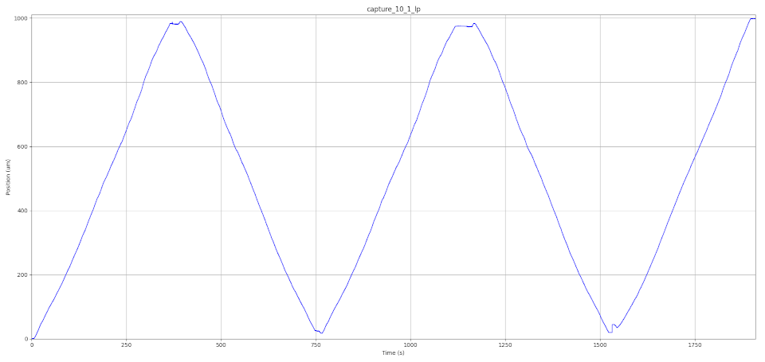
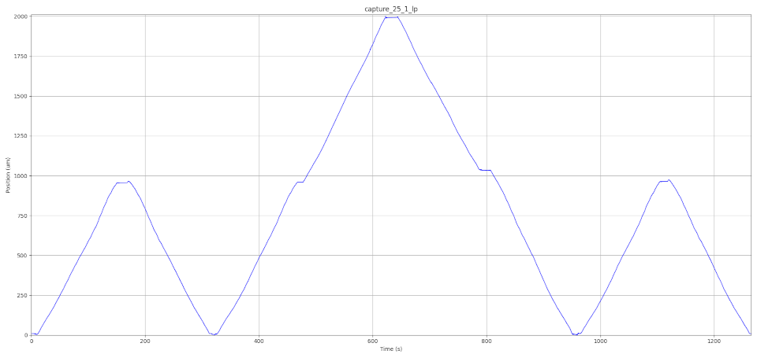
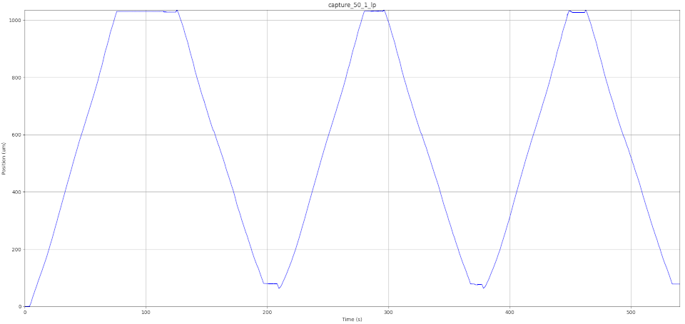
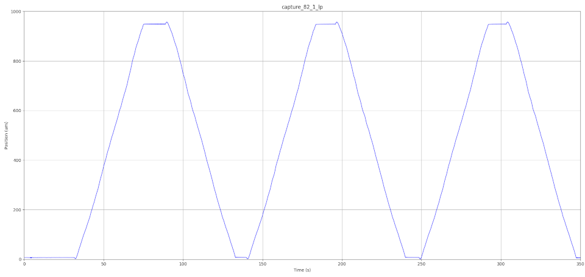
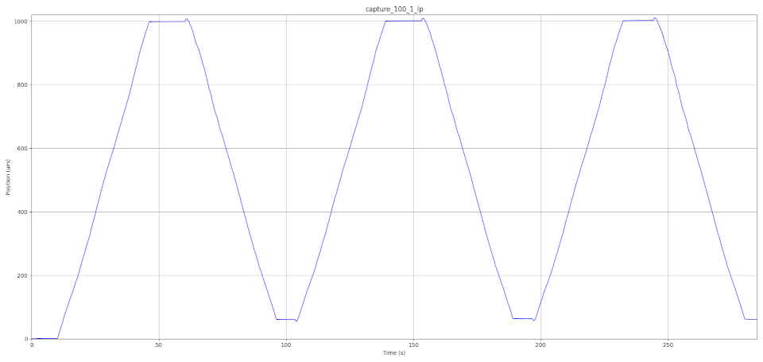

# AS5311 high-resolution sensor data analysis

## Dataset

Due limited space in github, the dataset is located in [Zenodo](https://doi.org/10.5281/zenodo.7513730), in this link there are two kind of files:

*   **bin**: raw binary files received from the AS5311 high resolution sensor. Although this sensor sends 12 bit data, we have truncated the most significant bits and receive only 8 bits (one byte). Therefore, each byte of these binary files is a measurement of the distance. Each distance increment corresponds to ~0.488nm (2mm/2048)
*   **csv**: csv files that can be opened with any spreadsheet app, such as Libreoffice Calc or Microsoft Excel, or even with a text editor. This file contains the processed data from the binary files. These files have been generated with the proc\_magn\_sensor.py Python script. These files have som columns, which are:
    *   index: measurement number
    *   time in milliseconds: each measurement is taken every 250 us
    *   median2: in micrometers, since the sensor may jitter, we have applied the median filter twice. All the data has been subtracted to the lowest value, making the lowest value equal to zero.
    *   median1: in micrometers, median filter only applied once. All the data has been subtracted to the lowest value, making the lowest value equal to zero.
    *   mean: in micrometers, mean filter. All the data has been subtracted to the lowest value, making the lowest value equal to zero.
    *   mean int: in micrometers, mean filter rounded to an integer value. All the data has been subtracted to the lowest value, making the lowest value equal to zero.
    *   orig\_base: this is not in micrometers, but in the units of the sensor (~0.488nm). The only processing done is that when there is an overflow of 255 to 0, or from 0 to 255, it adds the overflow to continue the trend. All the data has been subtracted to the lowest value, making the lowest value equal to zero.
    *   original: this is the data received from the sensor with no processing, each value is ~0.488nm
    *   mean2: in micrometers, mean filter applied twice. All the data has been subtracted to the lowest value, making the lowest value equal to zero.

There are two set of experiments:

*   Experiments with no load. These files start with _noload\__  
    In these experiments the gantry is moved 1 mm alternatively to the front and then reversing direction. Moving in this alternate way a few times. There are five experiments each of them with a different speed: v= 10 mm/h; 25 mm/h; 50 mm/h; 82 mm/h and 100 mm/h. The name of the file indicates the speed:
    1.  noload\_100mmh\_1mm: FBFBF: 1mm forth, 1mm back, 1mm forth, 1mm back, 1 mm forth
    2.  noload\_25mmh\_1mm: FBFFBBFB
    3.  noload\_50mmh\_1mm: FBFBFB
    4.  noload\_82mmh\_1mm: FBFBFB
    5.  noload\_100mmh\_1mm: FBFBFB
*   Experiments with a 5kg sand load. These files start with _load5kg\__
    1.  load5kg\_25mmh\_5mm: moving 5kg at 25mm/h a distance of 5mm
    2.  load5kg\_25mmh\_10mm: moving 5kg at 25mm/h a distance of 10mm
    3.  load5kg\_25mmh\_20mm: moving 5kg at 25mm/h a distance of 20mm
    4.  load5kg\_75mmh\_20mm: moving 5kg at 75mm/h a distance of 20mm
    5.  load5kg\_75mmh\_50mm: moving 5kg at 75mm/h a distance of 50mm
    6.  load5kg\_100mmh\_25mm: moving 5kg at 100mm/h a distance of 20mm
    7.  load5kg\_100mmh\_50mm: moving 5kg at 100mm/h a distance of 50mm

## Python scripts for processing the data


In order to process the raw binary data (.bin files of the dataset), the python script [proc_magn_sensor.py](./proc_magn_sensor.py) converts the binary file into the .csv file. These .csv files are available in the dataset. 

If you want to run the script, open it and uncomment the line related to the file you want to analyze. Then run it with this command

```
>> python3 proc_magn_sensor.py
```

Once you have the .csv file (that you can also download from the dataset, you can plot the graph, with [plot.py](./plot.py)


Also, you can plot the raw binary file to take a look to it, with [show_raw.py](./show_raw.py), for this script you have to introduce the binary file as a parameter.

----

## Plots of No-load experiments

Following, the plots of each no-load experiment are shown


###  No-load 10mmh 1mm FBFBF

1mm forth, 1mm back, 1mm forth, 1mm back, 1mm forth:



[larger image](imgs/noload/10mmh_tot_10101.png)

###  No-load 25mm/h 1mm FBFFBBFB

1mm forth, 1mm back, 1mm forth, 1mm forth, 1mm back, 1mm back, 1mm forth, 1mm back:



[larger image](imgs/noload/25mmh_tot_10110010.png)


###  No-load 50mm/h 1mm FBFBFB

1mm forth, 1mm back, 1mm forth, 1mm back, 1mm forth, 1mm back:



[larger image](imgs/noload/50mmh_tot_101010.png)


###  No-load 82mm/h 1mm FBFBFB

1mm forth, 1mm back, 1mm forth, 1mm back, 1mm forth, 1mm back:



[larger image](imgs/noload/82mmh_tot_101010.png)


###  No-load 100mm/h 1mm FBFBFB

1mm forth, 1mm back, 1mm forth, 1mm back, 1mm forth, 1mm back:



[larger image](imgs/noload/100mmh_tot_101010.png)

