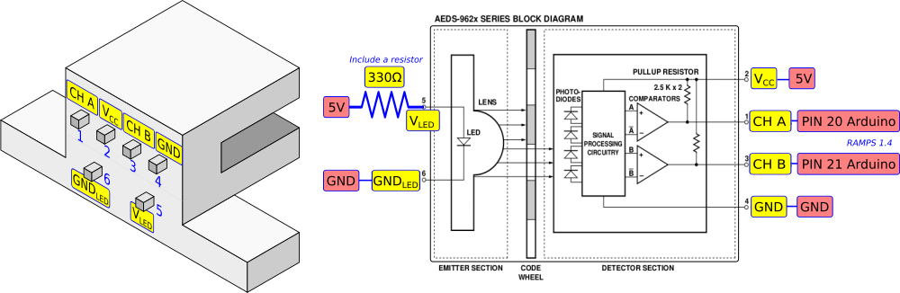

# Optional components

He have used two linear sensor to measure the displacement:

- Optical linear sensor
- [High-resolution magnetic sensor](#high-resolution-magnetic-sensor)

----

## Optical linear sensor

One is a optical linear sensor that has been savaged from an old printer. The sensor is 150 LPI (lines per inch) so it has a resolution around 169 μm per line.

The Arduino code includes the reading and display of the current position. However, since this component is optional, the Sandbox will work even if it is not installed.

The optical sensor that has been used is similar to the [AEDS-962x](./linear_optical_sensor/aeds-962x_150lpi.pdf)

The sensor needs a small circuit to work and to install it requires some soldering skills, especially if you to take it out from a printer.

A 330 Ohm resistor has to be included between 5V and the led emitter of the sensor. As shown in the following figure:

We have used a simple board to solder the sensor pins and the 330Ω resistor.

The following pictures show how the optical codestrip and the sensor is arranged

More information about these sensors:

- https://reprap.org/wiki/Optical_encoders_01
- https://cuverita.wordpress.com/2013/06/30/how-to-master-an-hp-printer-optical-encoder-carriage/

If you are going to buy one, maybe you could get the HEDS-973x Series. **Disclaimer:** We have not tried them, but they seem similar, and even simpler because the led do not have an independent power supply.

[HEDS-973x](./linear_optical_sensor/heds_973x.pdf)

----

## High resolution magnetic sensor

Since it is a high resolution sensor (less than 500 nm), the sensor will constantly update the measurement, as a consequence, it would demand too much attention from the Arduino and the system would not work properly. 
To solve this problem, we have used an external FPGA to measure the position. This sensor has been used only to validate the positional accuracy of the system.

We have used the breakout board, so it is not necessary to solder the chip, and it came with a magentic strip. The strip is small, but enough to make the experiments.

This is the [datasheet](./as5311_magn_sens/as5311_board.pdf) of the AS5311-TS-EK-AB adapter board.

And some links to suppliers where you can buy it:

- [Digikey](https://www.digikey.es/en/products/detail/ams-osram/AS5311-TS-EK-AB/3828353)
- [RS](https://es.rs-online.com/web/p/kits-de-desarrollo-de-sensores/2329691)
- [Mouser](https://eu.mouser.com/ProductDetail/ams-OSRAM/AS5311-TS_EK_AB?qs=Rt6VE0PE%2FOfQFCqoE7AuPw%3D%3D)
- [Farnell](https://es.farnell.com/ams-osram-group/as5311-ts-ek-ab/kit-placa-adapt-sensor-de-posici/dp/3976997?st=as5311)

More information on how the sensor works, the source code of the interface, and the Python scripts to analyze the received data, can be found in this folder:

[High-resolution linear magnetic sensor AS5311](./as5311_magn_sens/.)

