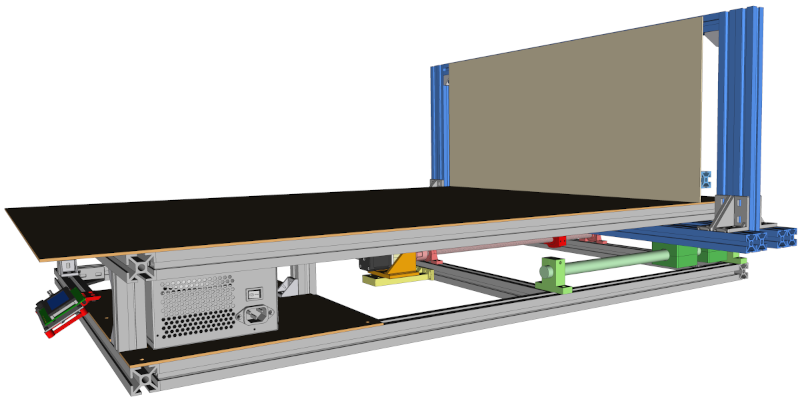
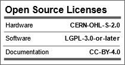
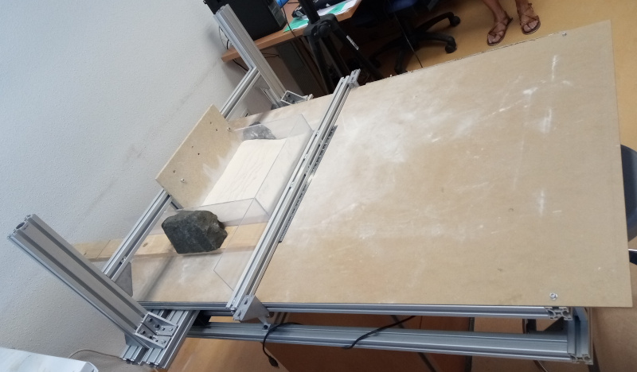
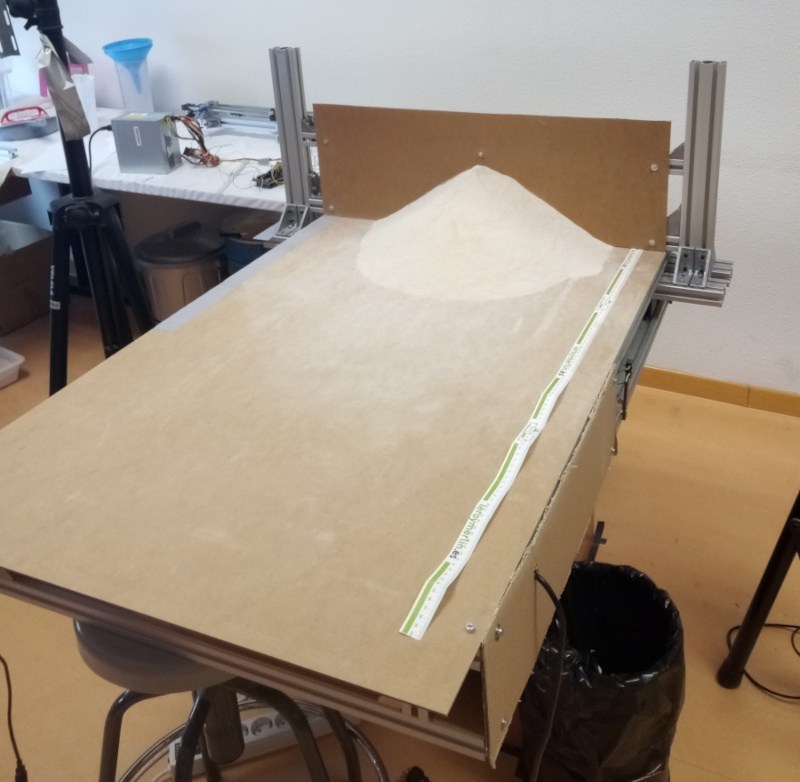
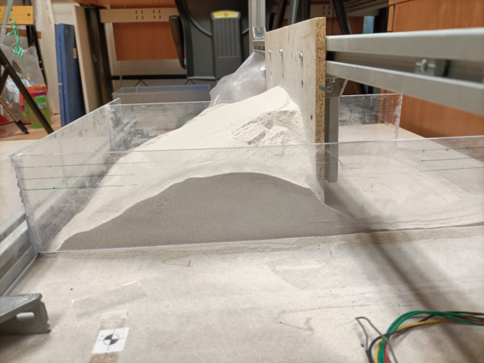

# Tectonic Open Hardware (TectOH) Sandbox

Low-cost Open-Hardware scientific and educational device for tectonic analogue modelling (https://en.wikipedia.org/wiki/Analogue_modelling_%28geology%29).

It can move at speeds from 1 mm/h to 100 mm/h. It stroke of the gantry is 270 mm but it can be easily customized for other lenghts.

The cost of the components is no more than 500 €, although for increased performance, precision components can be used at higher cost.

It is not too complicated to build. It should be simpler than building a 3D printer or CNC.

This is the second version of the Open Hardware Sandbox. [Link to the first version](https://github.com/URJCMakerGroup/TFG-Cristina-Fernandez) 

## License

Hardware License: [CERN-OHL-S 2.0](cern_ohl_s_v2.txt)

Software License: [LGPL 3.0 or later](License.md)

Documentation License: [CC BY 4.0](https://creativecommons.org/licenses/by/4.0/)

## Bill of materials

It is about 500€ without taxes and shipping costs.

There could be cheaper alternatives in your area.

You can use more expensive mechanical components to increase the overall precision of the system

[Sandbox bill of materials (.ods file)](tectoh_bom.ods)

## Assembly

[Sandbox assembly](./assembly/.)

## User guide

[Sandbox user guide](./userguide/.)

## Firmware
[Arduino code of the Sandbox](./firmware/.)

## Optional components

[Optical or magnetic linear sensor](./optional/.) can be used to monitor the displacement

## Pictures

Sandbox experiment

The Sandbox pushing a 10-kg sandpile

The Sandbox pushing a 5-kg sand load constrained within a box

