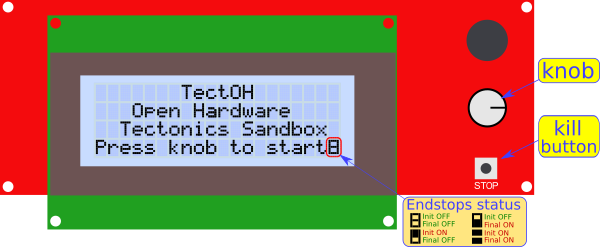

# User guide

## Welcome screen

At start you will see this screen.

Notice at the bottom-right of the screen that the endstops status are displayed. Check their status before starting the experiment.

[Larger welcome screen](./lcd_tectoh_p01_welcome.png)

## Taks selection

After you have pressed the knob, you will find a menu in which you can select from these options:

1. Homing (moving to the absolute zero position).
2. Moving a relative distance from where the gantry is
3. Getting information from the last experiment

To select the desired option, turn the knob and push when the desired option is active.

## Homing

If you select this option, you have to choose the speed. From 1 mm/h to 100 mm/h.
Move to the units and tens to select the value.

Once you have selected the speed and distance, select **Go!** to start the experiment. There will be another confirmation message before starting.

## Moving a relative distance

In this option you have to choose the speed (as in the Homing option) and also you have to select the relative distance you want to travel

Once you have selected the speed and distance, select **Go!** to start the experiment. There will be another confirmation message before starting.

## Last experiment info

Displays the information related to the last experiment. Press the knob when you are done.

## Moving

When the Sandbox is moving, it will display the information of the experiment.

Press the **Kill** button to abort the operation

Unless you disconect the power suply of the Sandbox while moving, it will save the actual position even if it is switched off. This is useful if the preparation of the experiment takes time. So you can move the gantry to the desired postion. Prepare the experiment, and then switch on the Sandbox and start the experiment.

